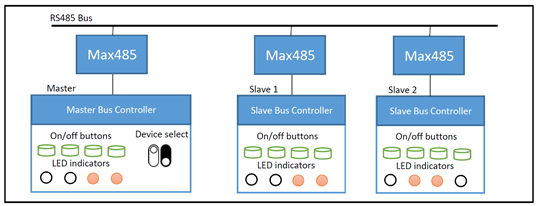
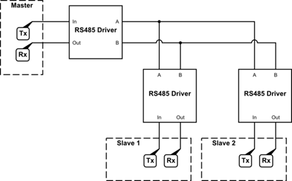
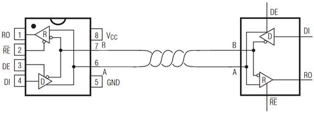

# Smart Keys Controller (Embeded System)

### Description 

Smart Key Control System is a system that aims to control all the smart keys in a house by a central controller.

In this system, the central controller has access to all the smart keys of the house by a serial bus, and therefore
has the lowest consumption in terms of wiring. It is assumed that all the smart home keys, as well as the central controller
of the system, communicate with each other by a program that runs on an Arduino board, and update their status according
to the commands of the central controller. 

The bus connection, which is used for all key controllers as well as the central controller is RS485 Bus.
This bus is configured as a single master multiple slave. 

In general, the system connection is as follows:

  

### RS485 Bus

As shown by the figure, all the smart key controllers as well as the central controller are connected to a common bus which is the RS485 bus.

The connections for an RS485 bus are as follows: 

  

Two wires (called A and B) are used to transmit information. 
This method is much better than the normal method for sending information over long distances and it is more resistant to noise.
In this case, at the destination, the difference between these two signals is used to detect the transmitted data. 

In addition to the bus being implemented as RS485, our Arduino boards operate in TTL and also use the usual TX and RX pins mounted on the boards to send data serially.
For this reason, in addition to the smart key controls, we need a component to convert between the TTL and RS485 protocols. 
In this implementation, the `MAX487` component is used for this conversion.

The general structure of the connections for `MAX487` can be seen in the following figure: 

  

Also, due to the common bus between all smart keys and the central controller, we need to define a protocol that properly send or receive information between all different parts of the system. 
For this reason, a special protocol for this system is defined on UART. 
More information about it can be found in the attached file. (`Data Sheets/protocol.pdf`)

### How it works

Smart keys can have a single bridges or more bridges. The various bridges of these smart key systems can be switched on and off separately via local buttons or by the central controller via a common bus.

There is a set of switches in the central controller by which a smart key can be selected. 
The smart key status is read continuously via the bus and displayed locally on the central controller.

In addition, after selecting a specific key in the central controller, you can turn on and off of the selected key bridges using the local keys. 

An example of how the system works, you can see `Assets/Example.mp4`.

## Note

The implementation of this system has been done by Proteus Pro 8.10 SP3 and Matlab R2020a.
